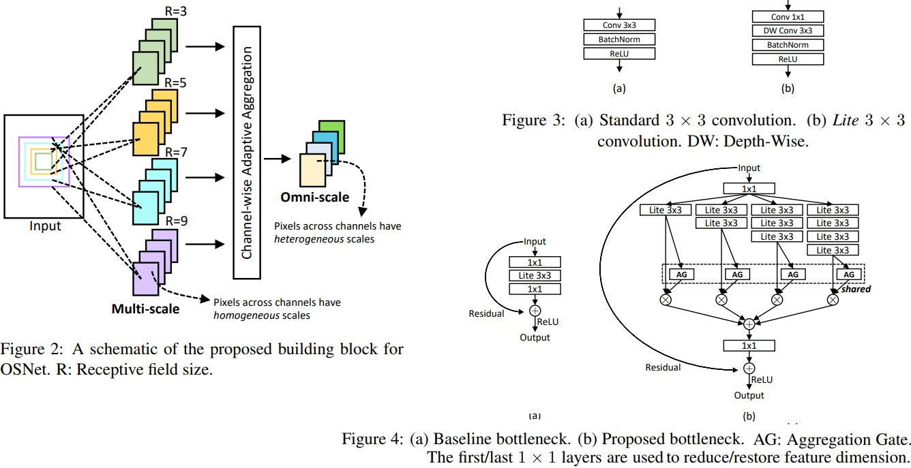
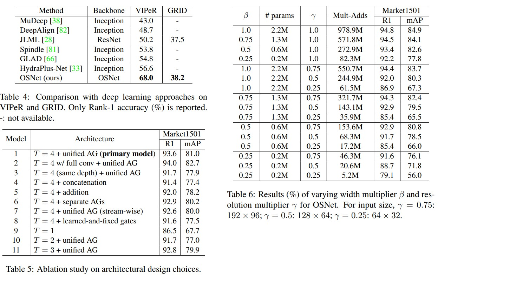

# Omni-Scale Feature Learning for Person Re-Identification

* Official paper: [ArXiv](https://arxiv.org/pdf/1905.00953.pdf)
* Official code: [Github](https://github.com/KaiyangZhou/deep-person-reid)

# Overview
- **omni-scale**, defined as the combination of variable homogeneous scales and heterogeneous scales, each of which is composed of a mixture of multiple scales.
- To match people and distinguish them from impostors, features corresponding small local regions (e.g. shoes, glasses) and global whole body regions are equally important.
for more challenging cases, even features of variable homogeneous scales would not be enough and more complicated and richer features that span multiple scales are required. 

- The feature scale that each stream focuses on is determined by exponent, a new dimension factor that is linearly increased across streams to ensure that various scales are captured in each block

-  the importance of multiscale feature learning has been recognised recently and the multi-stream building block design has also been adopted.
-   OSNet building block uses a scale-controlling factor to diversify the spatial scales to be captured.
-   OSNet is capable of learning omni-scale features with each feature channel potentially capturing discriminative features of either a single scale or a weighted mixture of multiple scales

# Architectures

## Omni-Scale Feature Learning

1. Depthwise Separable Convolutions
- To reduce the number of parameters, we adopt the depthwise separable convolutions in Xception, [MobileNet](mobilenet.md) 
- The basic idea is to divide a convolution layer ReLU(w ∗ x) with kernel $w = \mathbf{R}^{k \times k \times c \times c'}$ into two separate layers ReLU((v.u)∗x)
  - depthwise kernel $u = \mathbf{R}^{k \times k \times 1 \times c'}$
  - pointwise kernel $v = \mathbf{R}^{1 \times 1 \times c \times c'}$
  - But, OSnet use $\text{ReLU} ((u \dot v) * x)$ (pointwise -> depthwise instead of depthwise -> pointwise), which turns out to be more effective for omni-scale feature learningis shown in Fig.3

- We call such layer _Lite 3 × 3_ hereafter

2. Omni-Scale Residual Block
- Omni-Scale Residual Block is the residual bottleneck equipped with the Lite $3 \times 3$ layer (see Fig. 4(a))
  - Given an input $\boldsymbol{x}$, 
  - this bottleneck aims to learn a residual $\tilde{\boldsymbol{x}}$ with a mapping function _F_,
  
  $$\boldsymbol{y}=\boldsymbol{x}+\tilde{\boldsymbol{x}}, \quad \text { s.t. } \quad \tilde{\boldsymbol{x}}=F(\boldsymbol{x}) \quad \text{(Eq.1)}$$
  -  $F$ represents a Lite $3 \times 3$ layer that learns singlescale features $($ scale $=3)$
  -  Note that here the 1 × 1 layers are ignored in notation as they are used to manipulate feature dimension and do not contribute to the aggregation of spatial information

- **Multi-scale feature learning**. 
    - we extend the residual function F by introducing a new dimension,_exponent t_, which represents the scale of the feature
    - For $F^{t}$, with _t>1_:
      *   we stack _t_ Lite $3 \times 3$ layers
      *   this results in a receptive field of size $(2 t+1) \times(2 t+1)$
      *   the residual to be learned, $\tilde{\boldsymbol{x}}$, is the sum of incremental scales of representations up to $T$

    $$\tilde{\boldsymbol{x}}=\sum_{t=1}^{T} F^{t}(\boldsymbol{x}), \quad \text { s.t. } \quad T \geqslant 1  \quad \text{(Eq.2)}$$

    - In this paper,bottleneck is set with T = 4 (i.e. the largest receptive field is 9 × 9) as shown in Fig. 4(b).
  
-  **Unified aggregation gate.**

> To learn omni-scale features, we propose to combine the outputs of different streams in a dynamic way, i.e., different weights are assigned to different scales according to the input image, rather than being fixed after training.

   - the dynamic scale-fusion is achieved by a novel aggregation gate (AG), which is a _learnable neural network_.
   - Let $\boldsymbol{x}^{t}$ denote $F^{t}(\boldsymbol{x})$:
     - the omni-scale residual $\tilde{\boldsymbol{x}}$ is obtained by
  
    $$\tilde{\boldsymbol{x}}=\sum_{t=1}^{T} G\left(\boldsymbol{x}^{t}\right) \odot \boldsymbol{x}^{t}, \quad \text { s.t. } \quad \boldsymbol{x}^{t} \triangleq F^{t}(\boldsymbol{x})$$
      
      - $G\left(\boldsymbol{x}^{t}\right)$ is a vector with length spanning the entire channel dimension of $\boldsymbol{x}^{t}$
      - $\odot$ denotes the Hadamard product
      - $G$ is implemented as a mini-network composed of a non-parametric global average pooling layer and a multi-layer perceptron (MLP) with one ReLU-activated hidden layer and a reduction ratio is set to $16 .$ 
      - the output of the AG network $G\left(\boldsymbol{x}^{t}\right)$ is a vector rather a scalar for the _t_ th stream

3. Network Architecture

[t1](../../asset/images/Architectures/osnet-t1.jpg)

- **Relation to prior architectures**
  - In terms of multistream design, OSNet is related to Inception and ResNeXt
  - First, the multi-stream design in OSNet strictly follows the scale-incremental principle dictated by the exponent (Eq. 2)
    - Specifically, different streams have different receptive fields but are built with the same Lite 3 × 3 layers (Fig. 4(b))
    - a design is more effective at capturing a wide range of scales.
    -  In contrast, Inception was originally designed to have low computational costs by sharing computations with multiple streams which includes mixed operations of convolution and pooling, was handcrafted.
    -  [ResNeXt](resnext.md) has multiple equal-scale streams thus learning representations at the same scale
   -  Second, Inception/ResNeXt aggregates features by concatenation/addition while OSNet uses a unified AG (Eq. 3)
   -  Third, OSNet uses factorised convolutions and thus the building block and subsequently the whole network is lightweight

# Experiments

