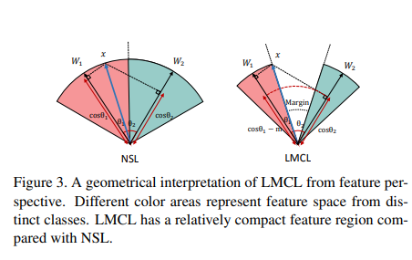

# CosFace: Large Margin Cosine Loss for Deep Face Recognition
Weiyang Liu, Yandong Wen, Zhiding Yu, Ming Li, Bhiksha Raj, Le Song. _3 Apr 2018_

The traditional softmax loss of deep CNNs usually lacks the power of discrimination. To address this problem, recently several loss functions such as center loss, large margin softmax loss, and angular softmax loss have been proposed. All these improved losses share the same idea: maximizing inter-class variance and minimizing intra-class variance.
This paper, we propose a novel loss function, namely large margin cosine loss (LMCL), to realize this idea from a different perspective.

* Official paper: [arXiv](https://arxiv.org/abs/1801.09414)
* Official code: [Github](https://paperswithcode.com/paper/cosface-large-margin-cosine-loss-for-deep)

## Overview

1. Drawback of softmax loss
2. Large Margin Cosine Loss (CosFace)
3. Hyperparameter tuning

## I. Drawback of softmax loss
>  The softmax loss(SL) separates features from different classes by maximizing the posterior probability of the ground-truth class.

1. Formalation
- The SL formulated as:
  $$ L_{s} = \frac{1}{N} \sum_{i=1}^n - log\frac{e^{f_{y_i}}}{\sum_{j=1} e^{f_j}} $$
  we fix the bias is 0 then $f_j$ is given by:
   $$f_i = W_{j}^T x = ||W_j|| . ||x|| \cos\theta_j $$
  where $\theta$ is the angle between $W_j$ and $x$. 
-  To develop effective feature learning, the norm of $W$ should be necessarily invariable. Thus, we fix  
$$||W_j|| = 1$$  and  $$||x|| = s$$  by  $L_{2}$  normalization. 
Then softmax will be only depended on $\theta$ as:
  $$ L_{s_{norm}} = \frac{1}{N} \sum_{i=1}^n - log\frac{e^{s \cos(\theta_{y_i, i})}}{\sum_{j=1}e^{s \cos(\theta_{y_i, i})}} $$

>Because we remove variations in radial directions by fixing $||x|| = s$, the resulting model learns features that are separable in the angular space.

2. Drawback
- Norm Softmax(NSL) forces $\cos(\theta_i) > \cos(\theta_j)$ for C_i and similarly for C_j, so that features from different classes are correctly classified, but:
> features learned by the NSL are not sufficiently discriminative because the NSL only emphasizes correct classification
- Specifically, SL or NSL define a weak boundary, which decide if x in the _i-th_ class or the _j-th_ class :
Softmax loss boundary
  $$||W_i||\cos(\theta_1) = ||W_j|| \cos(\theta_2) $$
Norm softmax loss boundary
  $$\cos(\theta_i) = \cos(\theta_j)$$
Consequently, the trained classifier with the SL/NSL
is unable to perfectly classify testing samples in the cosine space and not quite robust to noise

## II. Large Margin Cosine Loss (CosFace)
- To address problem of SM in cosine space, CosFace purposed adding a margin penalty into SM as:
  $$ L_{s_{norm}} = \frac{1}{N} \sum_{i=1}^n - log\frac{e^{s (\cos(\theta_{y_i, i}) - m}}{e^{s (\cos(\theta_{y_i, i}) - m} + \sum_{j=y_i}e^{s \cos(\theta_{y_i, i})}} $$
subject to 
$$W = \frac{W^\*}{||W^\*||}$$
$$x = \frac{x^\*}{||x^\*||}$$
$$\cos(\theta_j, i) = W_j^T x_i $$

- Cosface defines a decision margin in cosine space. For example, to decide x belong to 2 class 1-th or 2-th:
  $$C_1  :  \cos(\theta_1) \ge \cos(\theta_2) + m$$
  $$C_2  :  \cos(\theta_2) \ge \cos(\theta_1) + m$$
Therefore $\cos(\theta_1)$ is maximized while $\cos(\theta_2)$ being minimized for C_1 to perfrom the large-margin classification

## III. Hyperparameter tuning
- there are 2 hyperparameter massively affect to Cosface: m \& s
- with $s$ :
  $$s \ge \frac{C-1}{C} log \frac{(C-1)P_W}{1-P_W}$$
  where C is number of classes and $P_W$ denote the expected minimum posterior probability of class center
- with $m$, mathicaly m is a radian in range. A reasonable choice of larger $m \in [0,\frac{C}{C−1})$ should effectively boost the learning of highly discriminative features.
- When training on Casia-webface or MSMT2 dataset, m=0.35 s=64